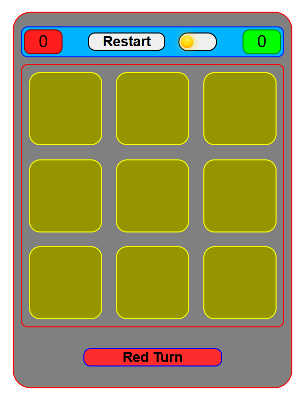
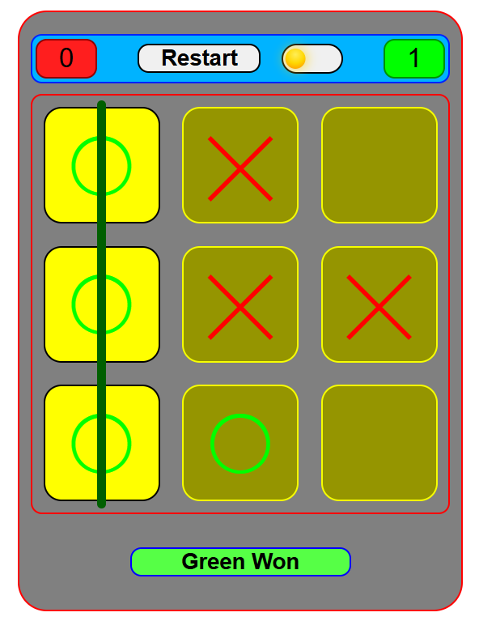
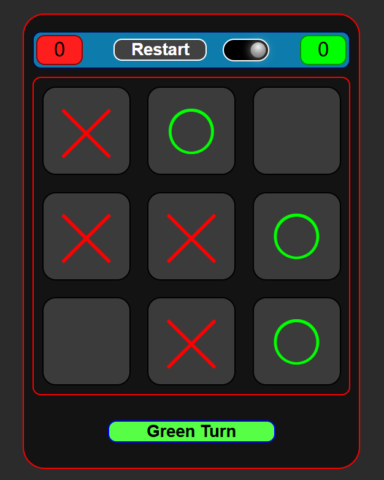
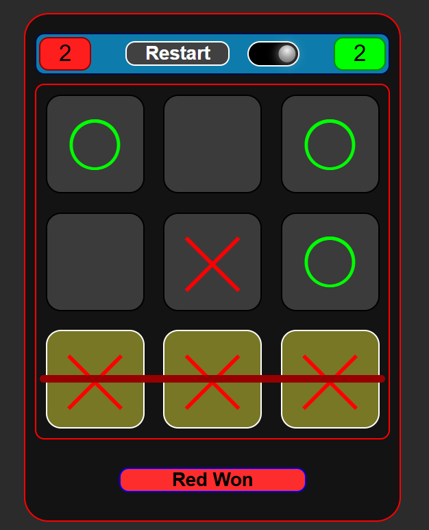

# Tic-Tac-Toe

A fun and interactive Tic-Tac-Toe game with theme switching and responsive design.

## Features

- **Two-player mode:** Play alternately as "Red" and "Green".
- **Theme Switching:** Switch between light and dark themes with animated icons.
- **Winning Visualization:** Highlights the winning combination with a line.
- **Responsive Design:** Adapts to different screen sizes for mobile and desktop.
- **Restart Game:** Reset the game board and scores with a single button.

## Screenshots







## How to Play

1. The game is played on a 3x3 grid.
2. Players take turns selecting a square:
   - Player 1 is **Red** (`X` symbol).
   - Player 2 is **Green** (`O` symbol).
3. The first player to align three symbols (horizontally, vertically, or diagonally) wins.
4. If all squares are filled without a winner, the game ends in a draw.
5. Click "Restart" to reset the game.

## Technologies Used

- **HTML:** Structure of the game board.
- **CSS:** Styling and responsive design.
- **JavaScript:** Game logic and interactivity.

## How to Run the Game

1. Clone the repository:
   ```bash
   git clone https://github.com/Prince-772/Tic-Tac-Toe.git
   ```
